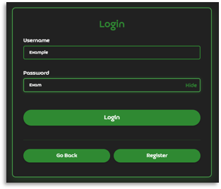
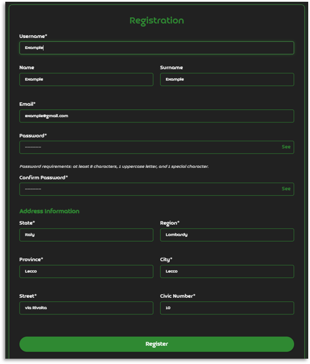
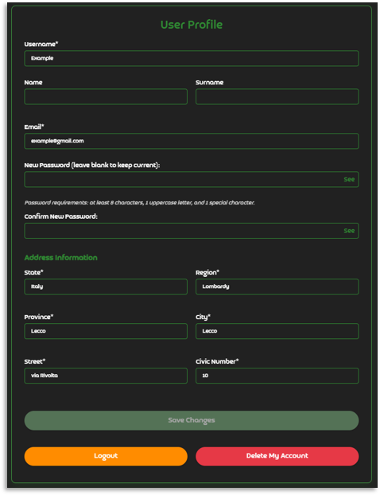
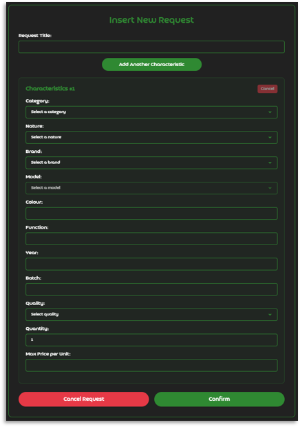
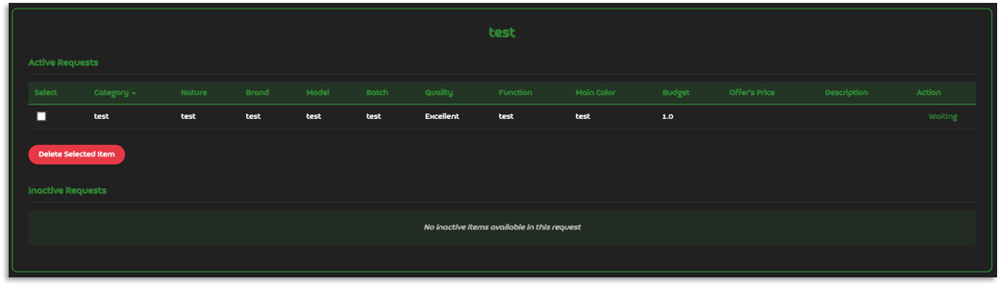
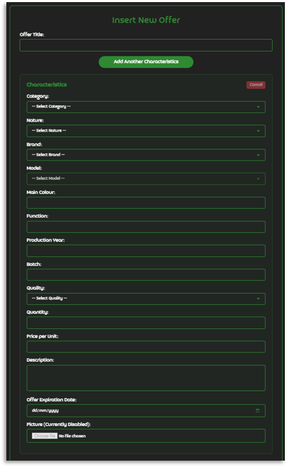
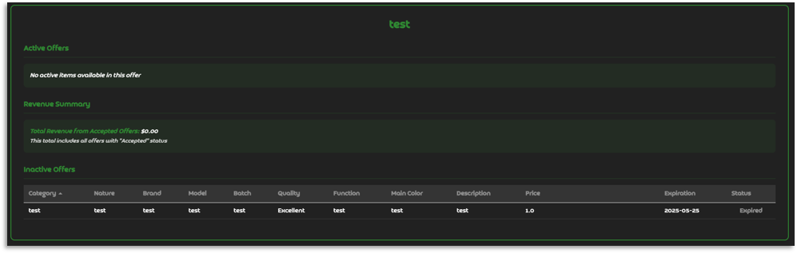

# E-Cycle

Marketplace platform for reselling unused goods through characteristic-based matching between requests and offers.

## Table of Contents

- [About](#about)
- [Features](#features)
- [Screenshots](#screenshots)
- [Project Structure](#project-structure)
- [Installation](#installation)
- [Usage](#usage)
- [Tech Stack](#tech-stack)
- [License](#license)

## About

Traditional marketplaces for unused goods are fragmented and lack structural logic. Supply and demand struggle to meet because there's no dedicated space where users can search for goods based on specific characteristics rather than exact product names. This creates inefficiency in the reuse economy.

E-Cycle solves this by providing a characteristic-based matching system that lets users offer goods they no longer need and search for items based on desired features, automatically pairing compatible requests and offers while facilitating negotiations with minimal effort.

## Features

- **User Management:** Registration, secure authentication, and profile management
- **Dual Interaction Model:** Create requests (what you're looking for) and offers (what you're selling)
- **Smart Matching:** Automatic characteristic-based matching between compatible requests and offers
- **Price-Aware:** Matching algorithm considers price ranges to ensure better compatibility
- **Negotiation System:** Direct communication interface between matched parties
- **Advanced Filtering:** Search and browse by category, nature, brand, and specific characteristics
- **Clear Decision System:** Accept or reject proposals with transparent feedback

## Screenshots

### Login


### Registration


### Profile Edit


### Request Insertion


### Request Details


### Offer Insertion


### Offer Details


## Project Structure

```text
E-Cycle/
├── src/
│   └── main/
│       ├── java/ecycle/ecycle/
│       │   ├── controllers/           # MVC and REST controllers
│       │   ├── models/                # JPA entities and request bodies
│       │   ├── repositories/          # Spring Data repositories
│       │   ├── services/              # Business logic and matching algorithm
│       │   └── EcycleApplication.java # Application entry point
│       └── resources/
│           ├── static/
│           │   ├── css/               # Stylesheets
│           │   └── js/                # Client-side scripts
│           ├── templates/             # Thymeleaf HTML templates
│           └── application.properties # Configuration
├── docs/
│   └── images/                        # UI screenshots
├── ecycle-empty.sql                   # Database schema
├── pom.xml                            # Maven build configuration
├── LICENSE
└── README.md
```

The project follows a standard Spring Boot layout:
- **controllers/**: Handles HTTP requests and view routing
- **models/**: JPA entities and form/request body classes
- **repositories/**: Database access interfaces
- **services/**: Core business logic and matching algorithm

## Installation

### Prerequisites

- Java 24 or newer
  - [Oracle](https://www.java.com/it/download/manual.jsp) or [OpenJDK](https://openjdk.org/)
- Maven 3.6 or newer
  - [Apache Maven](https://maven.apache.org/download.cgi)
- MySQL 8.0 or newer
  - [MySQL Community Server](https://dev.mysql.com/downloads/mysql/)

### Quick Start

1. **Clone the repository:**
   ```bash
   git clone https://github.com/LorenBll/E-Cycle.git
   cd E-Cycle
   ```

2. **Set up the database:**
   ```bash
   mysql -u [username] -p -e "CREATE DATABASE ecycle;"
   mysql -u [username] -p ecycle < ecycle-empty.sql
   ```

3. **Configure database connection:**
   Edit `src/main/resources/application.properties` with your credentials:
   ```properties
   spring.datasource.url=jdbc:mysql://localhost:3306/ecycle
   spring.datasource.username=[your-username]
   spring.datasource.password=[your-password]
   ```

4. **Build and run:**
   ```bash
   mvn spring-boot:run
   ```

5. **Access the application:**
   Open your browser and navigate to `http://localhost:8080`

## Usage

1. Register a new account or log in with existing credentials
2. Complete your profile with personal details
3. Create requests describing what you're looking for with specific characteristics
4. Create offers listing goods you want to resell with product details
5. Browse automatically generated matches between your requests and offers
6. Start negotiations with matched parties and accept or reject proposals

## Tech Stack

- **Backend:** Java 24, Spring Boot, Spring Web (MVC + REST), Spring Data JPA/Hibernate
- **Frontend:** Thymeleaf, HTML5, CSS, JavaScript
- **Database:** MySQL 8.0+
- **Build Tool:** Maven
- **Other:** Lombok

## License

This project is licensed under the terms specified in [LICENSE](LICENSE).
