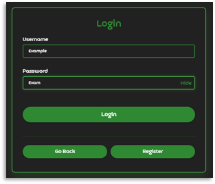
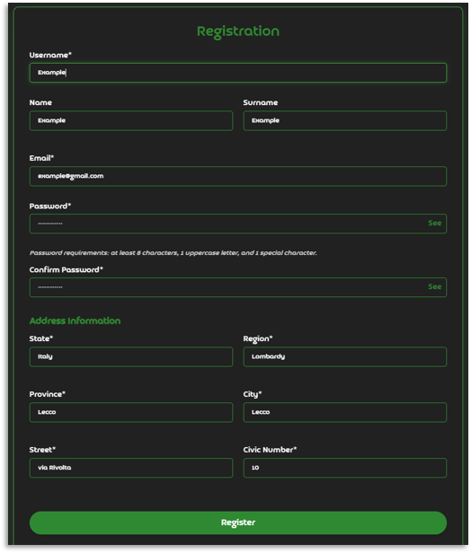
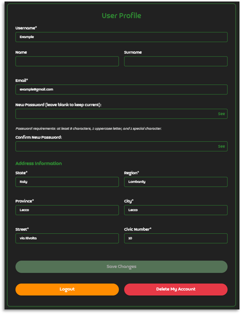
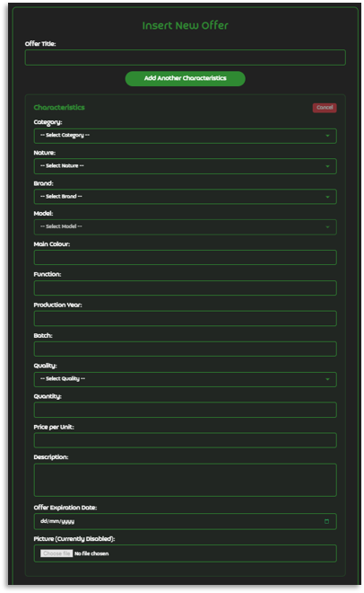
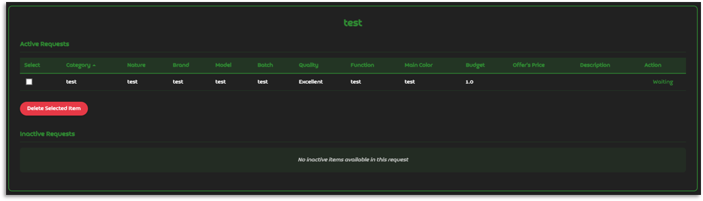

# E-Cycle

Today, those who want to dispose of goods have two options: accumulation, whether private or in landfills, and reuse.
Reuse encompasses three main practices:
- Up-cycling, where the item takes on a function different from its original purpose;
- Recycling, where the item is broken down into parts that re-enter the production cycle;
- Resale, where the item is transferred intact to another person, who will then use it as desired.

The simplest and most effective reuse activity is undoubtedly resale: the seller performs no processing on the item and simply profits, while the buyer obtains the desired object ready for their intended use. Simultaneously, the community benefits from the exchange through waste reduction (a buyer doesn't make purchases only to discard the obtained product).

Even today, however, selling unused goods remains complicated. Marketplaces are scattered and lack any structural logic: supply and demand struggle to meet. There's a lack of space where one can search not for a specific product, but for goods with certain characteristics.

E-Cycle was created to fill this void: the app's purpose is to facilitate the resale of unused goods, giving them new life.
Those who possess idle goods can offer them, and those who need them can search for them. Both act based on the actual characteristics of the goods, not just their commercial names.
With a few clicks, a request can find an answer, and a forgotten object can find a new context of use.

## Table of Contents
- [Warning/Disclaimer](#warningdisclaimer)
- [Glossary](#glossary)
- [Technologies](#technologies)
- [How to Execute the Project](#how-to-execute-the-project)
- [Features](#features)
- [Screenshots](#screenshots)

# Warning/Disclaimer

This project was developed as a school project and it's not meant to be used in a real-world scenario. It was developed in a short period of time and it's not optimized. The code is not clean and it's not meant to be used as a reference for best practices. The project was developed for educational purposes only. 

Being Italian, the PowerPoint File (in the ./docs/ folder) is written in Italian.

## Glossary

- **User**: Any subject registered on the app.
- **Characteristics** (or Characteristic Set): The set of properties that define an asset.
- **Brand and Model**: Respectively, the manufacturer and the specific name of the asset.
- **Category**: Macro-class of goods to which an asset belongs (e.g., "electronic device", "industrial vehicle", "office furniture").
- **Nature**: The common name by which the object is identified (e.g., "laptop", "industrial oven", "drill").
- **Interaction**: Either a request or an offer.
- **Request**: The formulation, by a user, of a need for one or more goods with specific characteristics. A request can concern homogeneous goods (identical to each other) or heterogeneous goods (different but compatible with distinct uses), and can therefore consist of multiple single requests.
- **Active Request**: A request in which all single requests are active.
- **Single Request**: The request, by a user, for a single good with specific characteristics.
- **Active Single Request**: A single request that has not been deleted, whose user has not been deleted, and that has not been satisfied in any negotiation.
- **Offer**: The availability, by a user, to provide one or more goods with specific characteristics. An offer can concern homogeneous or heterogeneous goods, and can therefore consist of multiple single offers.
- **Active Offer**: An offer in which all single offers are active.
- **Single Offer**: The offer, by a user, of a single good with specific characteristics.
- **Active Single Offer**: A single offer that has not been deleted, whose user has not been deleted, that has not expired, and that has not been accepted in any negotiation.
- **Matching**: The process through which the application compares a single request with available single offers, identifying those compatible in terms of characteristics and price.
- **Negotiation**: The phase in which a user views a single offer in relation to their single request and can decide to accept the purchase or reject it.

## Technologies

E-Cycle is built using the following technologies:

- **Backend**: Java with Spring Boot framework
- **Frontend**: HTML, CSS, JavaScript
- **Database**: MySQL
- **Build Tool**: Maven

## How to Execute the Project

1. Clone the repository:
   ```
   git clone [repository-url]
   ```

2. Navigate to the project directory:
   ```
   cd ecycle
   ```

3. Make sure you have Java and Maven installed.

4. Create a MySQL database named "ecycle" and run the SQL script `ecycle-empty.sql` to set up the database schema.

5. Configure the database connection in `src/main/resources/application.properties`.

6. Build and run the application:
   ```
   mvn spring-boot:run
   ```

7. Access the application at `http://localhost:8080`.

## Features

The project has the following features:

- User registration and authentication
- Profile management
- Creation and management of requests for goods
- Creation and management of offers for goods
- Automatic matching between requests and offers
- Negotiation system between users
- Search and filter functionality for requests and offers
- Notification system for matches and negotiations

## Screenshots

### Login


### Registration


### Profile Modification


### Request Insertion


### Offer Insertion


### Details View of Request


### Details View of Offer
