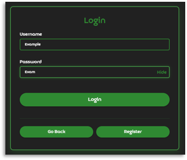
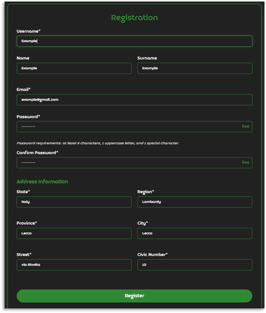
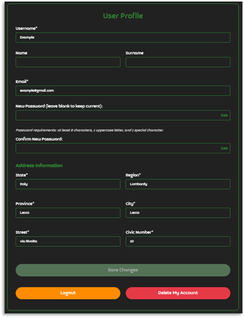
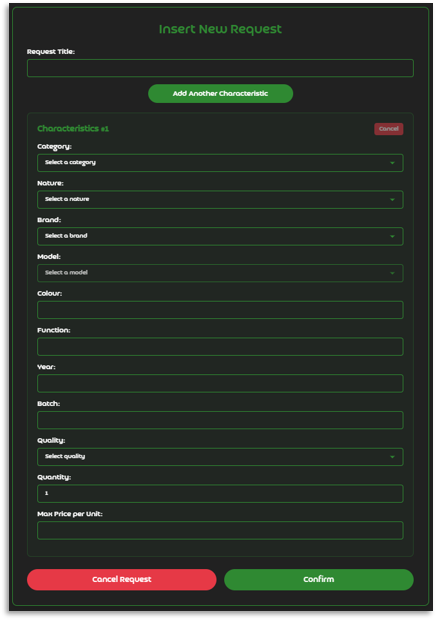
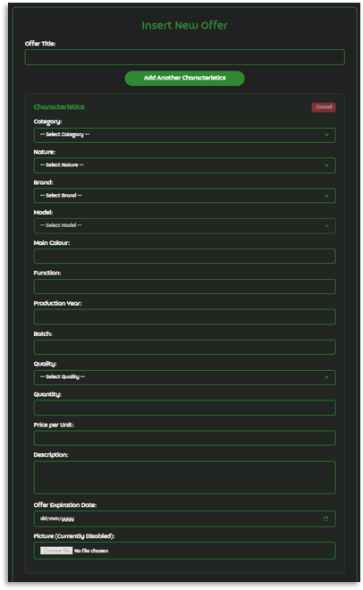
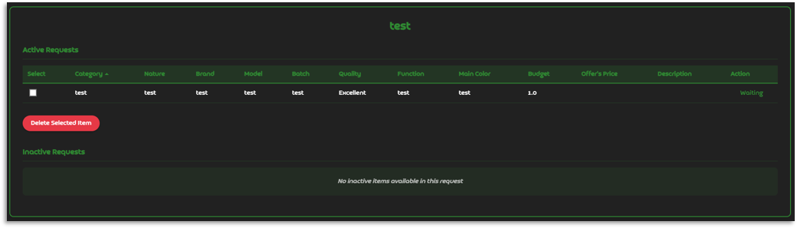
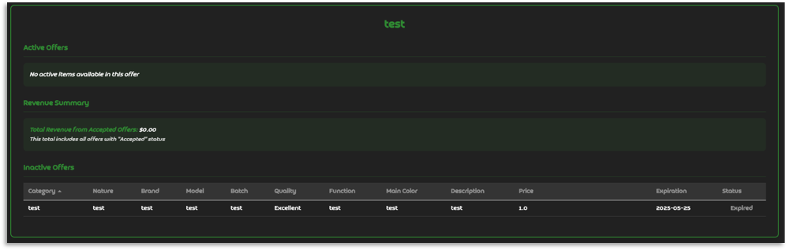

# E-Cycle

Oggi, chi vuole disfarsi di beni ha due opzioni: l'accumulo, sia privato che in discarica, e il riutilizzo.
Il riutilizzo comprende tre pratiche principali:
- Up-cycling, dove l'oggetto assume una funzione diversa da quella originaria;
- Riciclaggio, dove l'oggetto viene scomposto in parti che rientrano nel ciclo produttivo;
- Rivendita, dove l'oggetto viene trasferito integro a un'altra persona, che poi lo utilizzerà come desidera.

L'attività di riutilizzo più semplice ed efficace è senza dubbio la rivendita: il venditore non effettua alcuna lavorazione sull'oggetto e ne trae semplicemente profitto, mentre l'acquirente ottiene l'oggetto desiderato pronto per l'uso previsto. Allo stesso tempo, la comunità beneficia dello scambio grazie alla riduzione dei rifiuti (un acquirente non effettua acquisti solo per poi scartare il prodotto ottenuto).

Ancora oggi, tuttavia, vendere beni inutilizzati rimane complicato. I marketplace sono frammentati e privi di una logica strutturale: domanda e offerta faticano a incontrarsi. Manca uno spazio dove si possa cercare non un prodotto specifico, ma beni con determinate caratteristiche.

E-Cycle nasce per colmare questo vuoto: lo scopo dell'app è facilitare la rivendita di beni inutilizzati, dando loro nuova vita.
Chi possiede beni inutilizzati può offrirli, e chi ne ha bisogno può cercarli. Entrambi agiscono in base alle reali caratteristiche dei beni, non solo ai loro nomi commerciali.
Con pochi clic, una richiesta può trovare risposta e un oggetto dimenticato può trovare un nuovo contesto d'uso.

## Indice
- [Avvertenze/Disclaimer](#avvertentedisclaimer)
- [Glossario](#glossario)
- [Tecnologie](#tecnologie)
- [Come eseguire il progetto](#come-eseguire-il-progetto)
- [Funzionalità](#funzionalità)
- [Screenshot](#screenshot)

# Avvertenze/Disclaimer

Questo progetto è stato sviluppato come progetto scolastico e non è destinato all'uso in scenari reali. È stato sviluppato in un breve periodo di tempo e non è ottimizzato. Il codice non è pulito e non deve essere considerato come riferimento per le best practice. Il progetto è stato realizzato solo a scopo didattico.

Essendo italiano, il file PowerPoint (nella cartella ./docs/) è scritto in italiano.

## Glossario

- **Utente**: Qualsiasi soggetto registrato sull'app.
- **Caratteristiche** (o Insieme di Caratteristiche): L'insieme delle proprietà che definiscono un bene.
- **Marca e Modello**: Rispettivamente, il produttore e il nome specifico del bene.
- **Categoria**: Macro-classe di beni a cui appartiene un bene (es. "dispositivo elettronico", "veicolo industriale", "arredo ufficio").
- **Natura**: Il nome comune con cui viene identificato l'oggetto (es. "portatile", "forno industriale", "trapano").
- **Interazione**: Una richiesta o un'offerta.
- **Richiesta**: La formulazione, da parte di un utente, di un bisogno di uno o più beni con caratteristiche specifiche. Una richiesta può riguardare beni omogenei (identici tra loro) o eterogenei (diversi ma compatibili con usi distinti), e può quindi essere composta da più richieste singole.
- **Richiesta Attiva**: Una richiesta in cui tutte le richieste singole sono attive.
- **Richiesta Singola**: La richiesta, da parte di un utente, di un singolo bene con caratteristiche specifiche.
- **Richiesta Singola Attiva**: Una richiesta singola che non è stata eliminata, il cui utente non è stato eliminato e che non è stata soddisfatta in alcuna trattativa.
- **Offerta**: La disponibilità, da parte di un utente, a fornire uno o più beni con caratteristiche specifiche. Un'offerta può riguardare beni omogenei o eterogenei, e può quindi essere composta da più offerte singole.
- **Offerta Attiva**: Un'offerta in cui tutte le offerte singole sono attive.
- **Offerta Singola**: L'offerta, da parte di un utente, di un singolo bene con caratteristiche specifiche.
- **Offerta Singola Attiva**: Un'offerta singola che non è stata eliminata, il cui utente non è stato eliminato, che non è scaduta e che non è stata accettata in alcuna trattativa.
- **Matching**: Il processo attraverso cui l'applicazione confronta una richiesta singola con le offerte singole disponibili, identificando quelle compatibili in termini di caratteristiche e prezzo.
- **Trattativa**: La fase in cui un utente visualizza un'offerta singola in relazione alla propria richiesta singola e può decidere se accettare l'acquisto o rifiutarlo.

## Tecnologie

E-Cycle è costruito utilizzando le seguenti tecnologie:

- **Backend**: Java con framework Spring Boot
- **Frontend**: HTML, CSS, JavaScript
- **Database**: MySQL
- **Build Tool**: Maven

## Come eseguire il progetto

1. Clona il repository:
   ```
   git clone [repository-url]
   ```

2. Vai nella cartella del progetto:
   ```
   cd ecycle
   ```

3. Assicurati di avere Java e Maven installati.

4. Crea un database MySQL chiamato "ecycle" ed esegui lo script SQL `ecycle-empty.sql` per impostare lo schema del database.

5. Configura la connessione al database in `src/main/resources/application.properties`.

6. Compila ed esegui l'applicazione:
   ```
   mvn spring-boot:run
   ```

7. Accedi all'applicazione su `http://localhost:8080`.

## Funzionalità

Il progetto offre le seguenti funzionalità:

- Registrazione e autenticazione utenti
- Gestione del profilo
- Creazione e gestione delle richieste di beni
- Creazione e gestione delle offerte di beni
- Matching automatico tra richieste e offerte
- Sistema di trattativa tra utenti
- Funzionalità di ricerca e filtro per richieste e offerte
- Sistema di notifiche per matching e trattative

## Screenshot

### Login


### Registrazione


### Modifica Profilo


### Inserimento Richiesta


### Inserimento Offerta


### Dettaglio Richiesta


### Dettaglio Offerta
